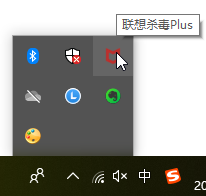

# SysCallError 10054 WSAECONNRESET

* **背景**

部分 https=tls=ssl 的url抓包，Mac中正常，但是Windows报错：

```bash
192.168.31.172:55087: CONNECT store1.hispace.hicloud.com:443
<< Cannot establish TLS with client (sni: store1.hispace.hicloud.com): TlsException("SSL handshake error: SysCallError(10054, 'WSAECONNRESET')")
TLS passthrough for ('tmge.alicdn.com', 443)
192.168.31.172:56214: CONNECT dnkeeper.hicloud.com:443
<< Cannot establish TLS with client (sni: dnkeeper.hicloud.com): TlsException("SSL handshake error: SysCallError(10054, 'WSAECONNRESET')")
TLS passthrough for ('zconfig.alibabausercontent.com', 443)

192.168.31.172:54363: CONNECT lf.snssdk.com:443
<< Cannot establish TLS with client (sni: lf.snssdk.com): TlsException("SSL handshake error: Error([('SSL routines', 'ssl3_read_bytes', 'sslv3 alert certificate unknown')])")
192.168.31.172:52353: CONNECT gecko-hl.snssdk.com:443
<< Cannot establish TLS with client (sni: gecko-hl.snssdk.com): TlsException("SSL handshake error: Error([('SSL routines', 'ssl3_read_bytes', 'sslv3 alert certificate unknown')])")
192.168.31.172:42426: CONNECT sf3-ttcdn-tos.pstatp.com:443
<< Cannot establish TLS with client (sni: sf3-ttcdn-tos.pstatp.com): TlsException("SSL handshake error: Error([('SSL routines', 'ssl3_read_bytes', 'sslv3 alert certificate unknown')])")
192.168.31.172:36743: CONNECT webcast-hl.amemv.com:443
<< Cannot establish TLS with client (sni: webcast-hl.amemv.com): TlsException("SSL handshake error: Error([('SSL routines', 'ssl3_read_bytes', 'sslv3 alert certificate unknown')])")
```

以及后来的游戏中点击付费按钮，产生的付费链接：

```bash
Loading script  mitmdumpUrlSaver.py
Proxy server listening at http://*:8081

192.168.31.172:57502: CONNECT hm.baidu.com:443
<< Cannot establish TLS with client (sni: hm.baidu.com): TlsException("(-1, 'Unexpected EOF')")

192.168.31.172:40054: CONNECT apiouterh5.37.com:443
<< Cannot establish TLS with client (sni: apiouterh5.37.com): TlsException("SSL handshake error: Error([('SSL routines', 'ssl3_read_bytes', 'sslv3 alert certificate unknown')])")

192.168.31.172:44871: CONNECT apipayh5.37.com:443<< Cannot establish TLS with client (sni: apipayh5.37.com): TlsException("SSL handshake error: SysCallError(10054, 'WSAECONNRESET')")

TLS passthrough for ('apipayh5.37.com', 443)192.168.31.172:36750: clientdisconnect

192.168.31.172:57503: CONNECT h5.37.com:443<< Cannot establish TLS with client (sni: h5.37.com): TlsException("(-1, 'Unexpected EOF')")
TLS passthrough for ('h5.37.com', 443)

TLS passthrough for ('hm.baidu.com', 443)192.168.31.172:57505: CONNECT paysdk.37.com:443
<< Cannot establish TLS with client (sni: paysdk.37.com): TlsException("(10054, 'WSAECONNRESET')")

TLS passthrough for ('paysdk.37.com', 443)
```

即，出现问题：

* 都是TLS passthrough掉了，保存的txt文件中，没有这些https的url
* 或者是部分https游戏付费链接 都是SSL handshake error

* **可能的原因**
  * windows中此处mitmproxy本身有问题？
  * windows中此处ssl底层库有问题？
  * windows中此处杀毒软件有问题？
    * 因为后来看到有个 联想杀毒plus
      * 
    * 不知道对此是否有影响？
