# 检测到代理显示异常

有些app、网页等，技术做的相对先进，能自动检测是否有代理：

* 如果检测到有代理
  * 会出现警告
  * 甚至不显示内容
  * 或者显示内容异常
  * 等等

* 对应解决办法：去掉代理
  * 比如切换到没有代理的WiFi
    * 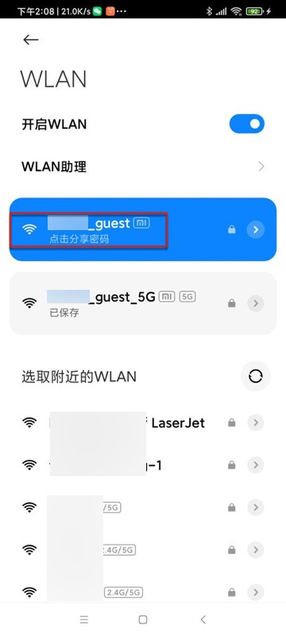

下面总结一下这些异常情况：

## 安全警告 该网站的安全证书存在问题

安卓手机中安装了mitmproxy代理后，部分app页面（首次打开）会弹框提示证书问题

比如 安卓中的微信的某些页面，第一次访问某些其他网站时，会提示证书问题：

* 【已解决】自动抓包工具适配iOS：安全警告弹框提示该网站的安全证书存在问题
  * 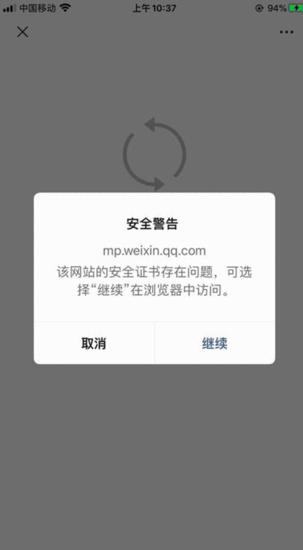
* vivo应用市场登录后，偶尔也有同样弹框
  * 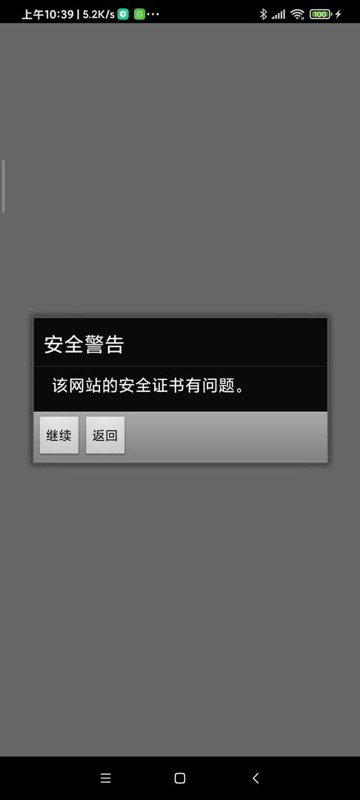

点击了继续后，后续就不会再提示。

类似问题：

当你Wifi代理有变动，比如：

* 去掉WiFi的mitmproxy的代理后，重新加上
* 换了一个WiFi，重新加上代理

等等情况，则会被视为第一次使用代理，第一次打开页面时，就仍会出现上述弹框提示。同理，点击继续后，之后不会再提示。

## 显示空白页面或者只显示部分内容

另外，有些安卓游戏，加了代理后，会导致游戏中和安全相关的，尤其是支付相关页面，会无法正常显示内容。

比如空白页面：

或者是 只能显示部分内容：

底部支付方式没显示：

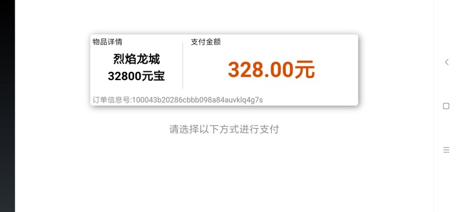

后来经过多次点击，偶尔才能完整显示内容：

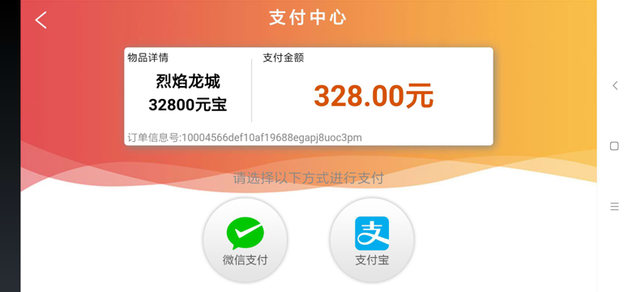

## 网络异常，请检查网络设置

iOS的app 斑马AI课 会提示：

> 网络异常，请检查网络设置
> 
> 请检查您当前的网络环境，如果其他App可以正常使用，请到设置-斑马AI课-无线数据中允许斑马AI课访问网络。检查后，点击重试按钮。

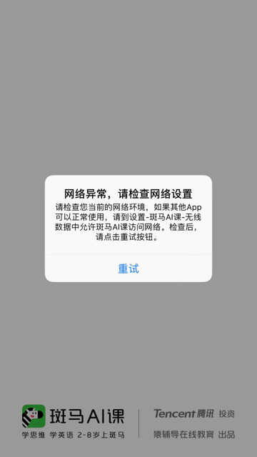

## 无法连接服务器，请退出重试

对于来自华为应用市场的游戏app，在登录时需要先登录华为应用市场。

当华为应用市场检测到有代理时，就会无法显示，报错：

无法连接服务器，请退出重试

解决办法：去掉代理

才能正常加载授权页面：

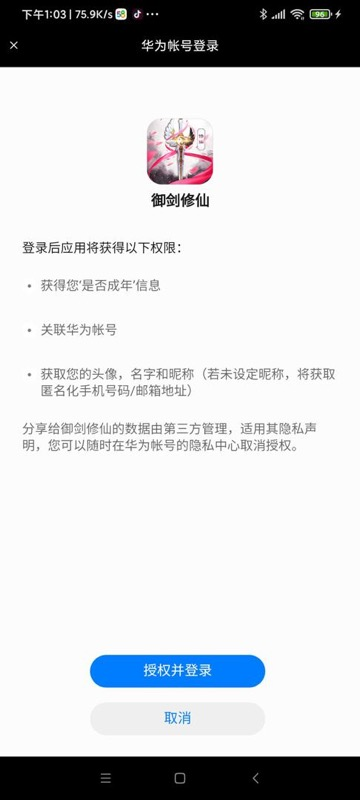

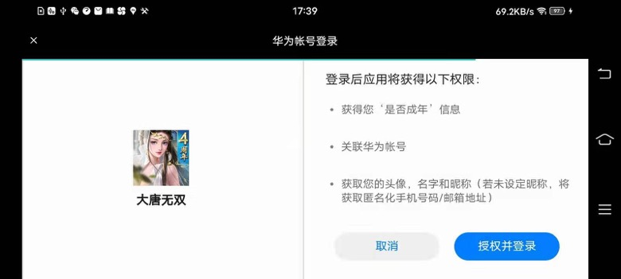

## 无法加载，请点击重试

偶尔vivo的支付弹框，也会出现，检测到代理后，无法正常显示，提示：

请检查网络或稍后再试

点击重试

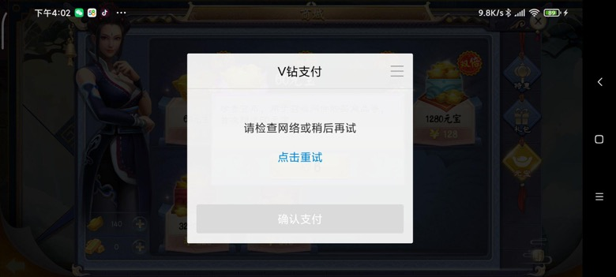

点击一下，即可正常显示：

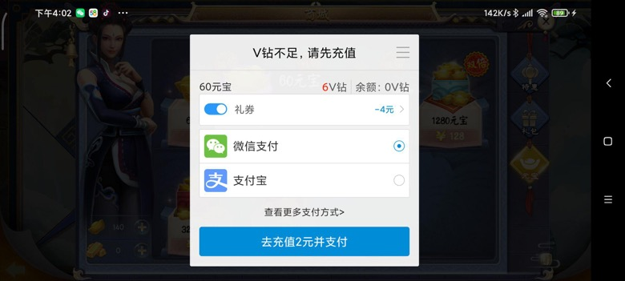

或者类似的：

加载失败

点击重试

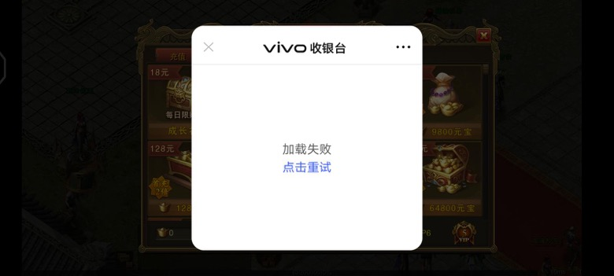

点击一下，即可正常显示支付：

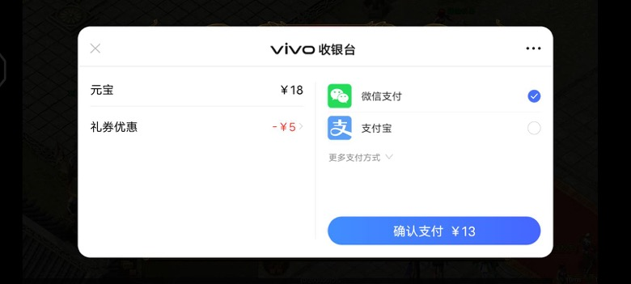

## 页面卡死在加载中

游戏app发行到vivo应用市场后，登录时往往要登录vivo账号。

其中一种登录弹框时，先显示 滑动补全缺口的图的验证码 的弹框，当vivo发现有代理时，则验证码图片弹框完全就无法显示，且卡死在验证码图片加载页面：

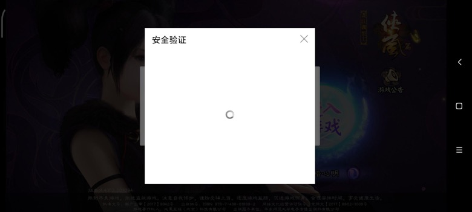

（通过切换WiFi而）去掉代理后，验证码图片才能正常显示：

## 支付方式弹框不显示，显示等待中

某游戏检测到有了代理后，支付弹框不显示，只提示：正在等待支付

## 请检查网络后，刷新重试！

小米应用市场发行的游戏登录时也需要登录小米账号授权，检测到代理后，会报错：

请检查网络后，刷新重试！

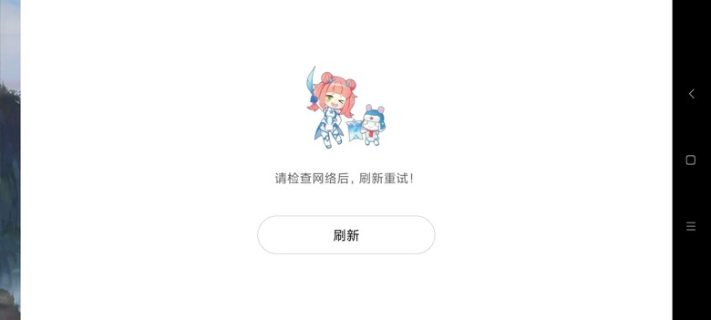
