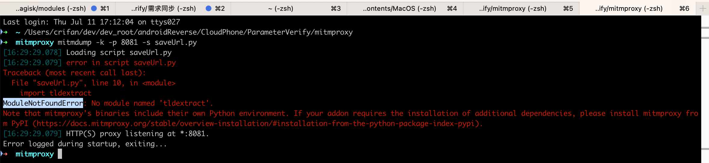

# ModuleNotFoundError No module named

## 现象

Mac中用brew安装了mitmproxy，然后去运行：

```bash
mitmdump -p 8081 -s middleware/Save1.py
```

但是报错：

* 现象1
  ```bash
  ModuleNotFoundError: No module named 'yaml'
  ```
* 现象2
  ```bash
  ➜  mitmproxy mitmdump -k -p 8081 -s saveUrl.py
  [16:21:46.972] Loading script saveUrl.py
  [16:21:46.973] error in script saveUrl.py
  Traceback (most recent call last):
    File "saveUrl.py", line 10, in <module>
      import tldextract
  ModuleNotFoundError: No module named 'tldextract'.
  Note that mitmproxy's binaries include their own Python environment. If your addon requires the installation of additional dependencies, please install mitmproxy from PyPI (https://docs.mitmproxy.org/stable/overview-installation/#installation-from-the-python-package-index-pypi).
  ```
  * 

## 原因

* 概述：mitmdump（即mitmproxy）中的Python环境中没有安装该Python库
* 详解
  * Mac中通过`brew`安装的`mitmproxy`，会调用自己内部安装的python（此处是`3.7.5`）
  * 而不是Mac中自己python（`2.7`或`3.8`）
    * 注：此时`Mac`中所有版本的`Python`中都安装过`yaml`了
  * 而`mitmproxy`中python，没有安装过`yaml`，所以上述脚本会报错。

## 解决办法

### 解决办法1

不要用brew安装，而是用系统中的python的pip去安装mitmproxy

```bash
pip install mitmproxy
```

注：系统中的python是,此处是用的3.8，用pyenv设置全局为3.8

另外此处2.7的python中，pip安装mitmproxy会失败。

之后即可正常调用

```bash
mitmdump -p 8081 -s middleware/Save1.py
```

其中python解析器用的是此处系统的python了，因此可以正常找到（系统中python中已安装的）yaml，而不会报错了。

具体细节详见：

* 【基本解决】Mac中mitmdump运行命令报错：in script py No module named yaml

### 解决办法2

如果上述办法不生效，则：

#### 根本原因

mitmdump（即mitmproxy）内部自带了一个自己的Python环境

即：mitmdump（即mitmproxy）中的Python，和系统的Python，不是同一个

### 根本解决办法

给mitmproxy中能识别第三方Python库==给mitmproxy中安装第三方Python库

#### 具体步骤

可以用官网推荐的pipx

（1）安装pipx

```bash
brew install pipx
pipx ensurepath
sudo pipx ensurepath --global
```

（2）用pipx安装mitmproxy

```bash
pipx install mitmproxy
```

（3）给mitmproxy中安装（插入）第三方Python库

```bash
mitmproxy pipx inject mitmproxy tldextract
```

（4）【可选，但很重要】确保此时你的终端=环境变量中，第一个找到的=实际生效的mitmproxy，是pipx所安装的

此处的意思是

前面通过pipx安装的mitmproxy后

```bash
pipx install mitmproxy
```

会提示你实际生效的位置，mitmproxy所在的PATH是哪个

此处是提示：

```bash
➜  mitmproxy pipx install mitmproxy
⚠️  Note: mitmdump was already on your PATH at /usr/local/bin/mitmdump
⚠️  Note: mitmproxy was already on your PATH at /usr/local/bin/mitmproxy
⚠️  Note: mitmweb was already on your PATH at /usr/local/bin/mitmweb
  installed package mitmproxy 10.3.1, installed using Python 3.12.4
  These apps are now globally available
    - mitmdump
    - mitmproxy
    - mitmweb
⚠️  Note: '/Users/crifan/.local/bin' is not on your PATH environment variable. These apps will not be globally accessible until your PATH is updated. Run `pipx
    ensurepath` to automatically add it, or manually modify your PATH in your shell's config file (e.g. ~/.bashrc).
done! ✨ 🌟 ✨
```

中的

`/Users/crifan/.local/bin`

所以你后续要确保：

后续终端命令行中，所找到的mitmproxy，是我们希望的：

用pipx安装的，插入安装了第三方Python库的）mitmproxy

而实现这个目的的典型方式是：

* 把此处对应的路径 `/Users/crifan/.local/bin` 加到环境变量PATH中去
* 且确保在前面（如果你本身PATH中其他的在前面的路径已经包含了，另外别的方式安装的mitmproxy）
  * 就像我此处：之前已经通过brew和pip安装了mitmproxy了，对应别的路径（`/usr/local/bin/`、`/opt/homebrew/bin/`）就会包含mitmproxy

此处具体处理方式就是：

编辑启动脚本（此处是：~/.zshrc）

```bash
vim ~/.zshrc
```

把 `/Users/crifan/.local/bin` 加到PATH的最开始

```
# Created by `pipx` on 2024-07-14 08:54:02
#export PATH="$PATH:/Users/crifan/.local/bin"
export PATH="/Users/crifan/.local/bin:$PATH"
```

[可选]再去让当前终端生效

```bash
source ~/.zshrc
```

详见：

[Installation (mitmproxy.org)](https://docs.mitmproxy.org/stable/overview-installation/#installation-from-the-python-package-index-pypi)

后记：

然后再去查看对应的mitmdump，可以看到，有多个路径，且第一个是我们希望的版本：

```bash
➜  mitmproxy where mitmdump
/Users/crifan/.local/bin/mitmdump
/usr/local/bin/mitmdump
/opt/homebrew/bin/mitmdump
/usr/local/bin/mitmdump
/Users/crifan/.local/bin/mitmdump
/Users/crifan/.local/bin/mitmdump
```

mitmdump即可正常运行：

```bash
mitmdump -k -p 8081 -s saveUrl.py
```

而不报错了
