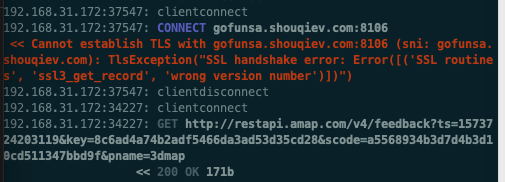

# ssl3_get_record wrong version number

* **现象**

自动抓包工具抓取安卓app`GoFun出行`期间，mitmproxy的log中一直出现：

```bash
192.168.31.172:37547: CONNECT gofunsa.shouqiev.com:8106
 << Cannot establish TLS with gofunsa.shouqiev.com:8106 (sni: gofunsa.shouqiev.com): TlsException("SSL handshake error: Error([('SSL routines', 'ssl3_get_record', 'wrong version number')])")
```



* **尝试解决**

```bash
openssl s_client -debug -connect gofunsa.shouqiev.com:8106
```

输出有：

```bash
SSL-Session:
    Protocol  : TLSv1.2
    Cipher    : 0000
    Session-ID:
    Session-ID-ctx:
    Master-Key:
    Start Time: 1573725685
    Timeout   : 7200 (sec)
    Verify return code: 0 (ok)
```

看起来版本没问题，是：`TLS v1.2`

后来注意到上面输出了：

```bash
4574582380:error:1400410B:SSL routines:CONNECT_CR_SRVR_HELLO:wrong version number:/BuildRoot/Library/Caches/com.apple.xbs/Sources/libressl/libressl-22.260.1/libressl-2.6/ssl/ssl_pkt.c:386:
```

也说是：

* wrong version number
  * and then try adding flags from this set: `-no_ssl2`, `-no_ssl3` and `-no_tls1` (consult the s_client(1) manual page for more details) to work  out which version of SSL/TLS has to be enabled for the connection to  succeed.

另外通过：

```bash
 brew info openssl
openssl: stable 1.0.2t (bottled) [keg-only]
SSL/TLS cryptography library
https://openssl.org/
Not installed
From: https://github.com/Homebrew/homebrew-core/blob/master/Formula/openssl.rb
==> Caveats
A CA file has been bootstrapped using certificates from the SystemRoots
keychain. To add additional certificates (e.g. the certificates added in
the System keychain), place .pem files in
  /usr/local/etc/openssl/certs

and run
  /usr/local/opt/openssl/bin/c_rehash

openssl is keg-only, which means it was not symlinked into /usr/local,
because Apple has deprecated use of OpenSSL in favor of its own TLS and crypto libraries.

==> Analytics
install: 145,281 (30 days), 708,633 (90 days), 5,855,621 (365 days)
install_on_request: 61,384 (30 days), 181,370 (90 days), 877,804 (365 days)
build_error: 0 (30 days)
```

可以看出此处mac安装的openssl的库的版本，是1.0.2t的？

后来：

```bash
mitmdump --help
```

其中有：

* --ssl-insecure, -k    
  * Do not verify upstream server SSL/TLS certificates

有空再试试能否解决此问题。

* 细节详见
  *【未解决】安卓抓包mitmproxy报错：TlsException SSL handshake Error routines ssl3_get_record wrong version number
