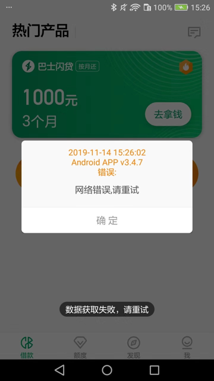
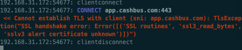

# sslv3 alert certificate unknown

mitmdump访问部分url出错：

比如：

某次报错：

```bash
192.168.31.177:50670: CONNECT 6ib5h.com:443
<< Cannot establish TLS with client (sni: 6ib5h.com): TlsException("SSL handshake error: Error([('SSL routines', 'ssl3_read_bytes', 'sslv3 alert certificate unknown')])")
```

和

抓包安卓app`现金巴士`时：



对应mitmdump的log：

```bash
<< Cannot establish TLS with client (sni: app.cashbus.com): TlsException("SSL handshake error: Error([('SSL routines', 'ssl3_read_bytes', 'sslv3 alert certificate unknown')])")
```



* **原因**

app内部做了certificate pinning 证书固定 的技术

app内部给证书做了指纹，只允许来自服务器的证书，匹配后才认为是合法的有效的，否则就拒绝

即拒绝那些指纹不匹配的证书

* **如何解决**
  * 分2种情况：
    * 用`tls_passthrough.py`实现部分解决
    * 无法解决

## 用`tls_passthrough.py`实现部分解决

借用别人的脚本：

* [tls_passthrough.py](https://github.com/mitmproxy/mitmproxy/blob/master/examples/complex/tls_passthrough.py)

去：

* 要么直接利用：
  * `mitmproxy -s tls_passthrough.py`
* 要么整理到自己的脚本中：
  * `mitmdump -p 8081 -s Save1.py`

其中：`Save1.py`

```python
# _*_ coding: utf-8 _*_

import json
import re
import os
import sys
print("sys.executable=%s" % sys.executable)

class Saver:

	def __init__(self):
		...

	def request(self, flow):
		curReq = flow.request
    url = curReq.url
		headers = curReq.headers
		print("url=%s, headers=%s" % (url, headers))
    # do what you want
    # eg: save something to some file

addons = [Saver()]

"""
This inline script allows conditional TLS Interception based
on a user-defined strategy.
Example:
    > mitmdump -s tls_passthrough.py
    1. curl --proxy http://localhost:8080 https://example.com --insecure
    // works - we'll also see the contents in mitmproxy
    2. curl --proxy http://localhost:8080 https://example.com --insecure
    // still works - we'll also see the contents in mitmproxy
    3. curl --proxy http://localhost:8080 https://example.com
    // fails with a certificate error, which we will also see in mitmproxy
    4. curl --proxy http://localhost:8080 https://example.com
    // works again, but mitmproxy does not intercept and we do *not* see the contents
Authors: Maximilian Hils, Matthew Tuusberg
"""
import collections
import random

from enum import Enum

import mitmproxy
from mitmproxy import ctx
from mitmproxy.exceptions import TlsProtocolException
from mitmproxy.proxy.protocol import TlsLayer, RawTCPLayer

class InterceptionResult(Enum):
    success = True
    failure = False
    skipped = None

class _TlsStrategy:
    """
    Abstract base class for interception strategies.
    """

    def __init__(self):
        # A server_address -> interception results mapping
        self.history = collections.defaultdict(lambda: collections.deque(maxlen=200))

    def should_intercept(self, server_address):
        """
        Returns:
            True, if we should attempt to intercept the connection.
            False, if we want to employ pass-through instead.
        """
        raise NotImplementedError()

    def record_success(self, server_address):
        self.history[server_address].append(InterceptionResult.success)

    def record_failure(self, server_address):
        self.history[server_address].append(InterceptionResult.failure)

    def record_skipped(self, server_address):
        self.history[server_address].append(InterceptionResult.skipped)

class ConservativeStrategy(_TlsStrategy):
    """
    Conservative Interception Strategy - only intercept if there haven't been any failed attempts
    in the history.
    """

    def should_intercept(self, server_address):
        if InterceptionResult.failure in self.history[server_address]:
            return False
        return True

class ProbabilisticStrategy(_TlsStrategy):
    """
    Fixed probability that we intercept a given connection.
    """

    def __init__(self, p):
        self.p = p
        super(ProbabilisticStrategy, self).__init__()

    def should_intercept(self, server_address):
        return random.uniform(0, 1) < self.p

class TlsFeedback(TlsLayer):
    """
    Monkey-patch _establish_tls_with_client to get feedback if TLS could be established
    successfully on the client connection (which may fail due to cert pinning).
    """

    def _establish_tls_with_client(self):
        server_address = self.server_conn.address

        try:
            super(TlsFeedback, self)._establish_tls_with_client()
        except TlsProtocolException as e:
            tls_strategy.record_failure(server_address)
            raise e
        else:
            tls_strategy.record_success(server_address)

# inline script hooks below.

tls_strategy = None

def load(l):
    l.add_option(
        "tlsstrat", int, 0, "TLS passthrough strategy (0-100)",
    )

def configure(updated):
    global tls_strategy
    if ctx.options.tlsstrat > 0:
        tls_strategy = ProbabilisticStrategy(float(ctx.options.tlsstrat) / 100.0)
    else:
        tls_strategy = ConservativeStrategy()

def next_layer(next_layer):
    """
    This hook does the actual magic - if the next layer is planned to be a TLS layer,
    we check if we want to enter pass-through mode instead.
    """
    if isinstance(next_layer, TlsLayer) and next_layer._client_tls:
        server_address = next_layer.server_conn.address

        if tls_strategy.should_intercept(server_address):
            # We try to intercept.
            # Monkey-Patch the layer to get feedback from the TLSLayer if interception worked.
            next_layer.__class__ = TlsFeedback
        else:
            # We don't intercept - reply with a pass-through layer and add a "skipped" entry.
            mitmproxy.ctx.log("TLS passthrough for %s" % repr(next_layer.server_conn.address), "info")
            next_layer_replacement = RawTCPLayer(next_layer.ctx, ignore=True)
            next_layer.reply.send(next_layer_replacement)
            tls_strategy.record_skipped(server_address)
```

* **效果**：至少不报错了

mitmproxy的log会显示相关的`TLS passthrough`：

```bash
TLS passthrough for ('app.cashbus.com', 443)
```

其他（https的？）资源（图片等）类的文件可以正常加载，页面可以显示（图片）等内容了：


* 细节详见
  * 【已解决】提取自动抓包工具中的mitmdump自动保存代理抓包出来的url链接保存到文件
  * 【已解决】mitmproxy代理抓包安卓app数据访问出错：Cannot establish TLS with client sni TlsException

## 无法解决

* **彻底的解决办法**：修改app的逻辑和规则，允许你（的非法）的证书。
 * 很明显：是别人的app，自己无法修改。所以此处实际上无解
   * 除非你能破解app，重新编译和运行破解后的app，把证书的限制去掉。

另外：此处被测app是一个安卓游戏app，也没有时间去折腾破解app

也没必要：因为最终方案是希望支持无限多的安卓游戏app，所以一个个破解，也不现实不可行。

总之：无解，且放弃

* 相关
  * 安卓破解 Certificate pinning
    * 作者提到了一些关于逆向工程安卓app方面的资料
      * 需要给app打包，用于跳过证书验证，换成自己证书
    * 相关资料：
      * [Android Security: SSL Pinning. Using SSL in an Android app is easy… | by Matthew Dolan | Medium](https://medium.com/@appmattus/android-security-ssl-pinning-1db8acb6621e)
      * [Bypassing Certificate Pinning on Android for fun and profit | by Felipe Lima | Medium](https://medium.com/@felipecsl/bypassing-certificate-pinning-on-android-for-fun-and-profit-1b0d14beab2b)
      * ->
      * [Bypassing SSL Pinning on Android via Reverse Engineering.pdf](https://security-assessment.com/files/documents/whitepapers/Bypassing%20SSL%20Pinning%20on%20Android%20via%20Reverse%20Engineering.pdf)
        * https://dl.packetstormsecurity.net/papers/general/android-sslpinning.pdf
* 细节详见
  * 【无法解决】安卓游戏加了代理后支付页面时mitmdump报错：TlsException SSL handshake error Error SSL routines ssl3_read_bytes sslv3 alert certificate unknown

