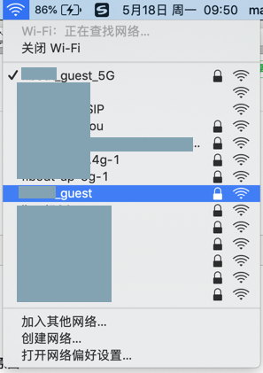
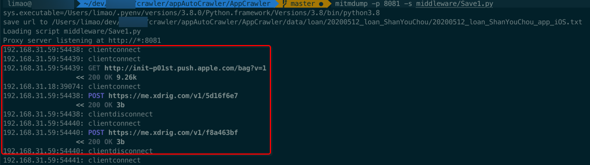

# mitmdump偶尔突然无效

* **现象**

Mac中正常启动mitmdump：

```bash
mitmdump -p 8081 -s middleware/Save1.py
```

作为手机中WiFi的代理，一直可以正常工作。

但是最近遇到几次了：

突然，不知道什么原因，mitmdump，就无效了。

导致手机中虽然设置了mitmdump的代理，但是传入mitmdump的脚本无效，无法过滤出url，保存到文件中了。

* **解决办法**：切换WiFi

无意间发现：切换WiFi，比如从`xxx_guest`切换到`xxx_guest_5G`：



即可解决此问题，mitmdump又重新正常工作了，手机端代理就生效了：



后记：

* 手机中：切换不同的WiFi（再加上代理）
  * 多试试几次，也可以规避此 代理不工作 的问题
