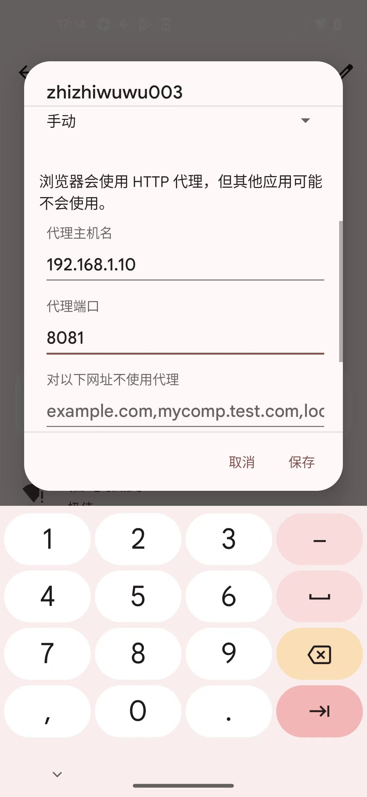

# 移动端给WiFi设置代理

之后再去给移动端的WiFi设置（PC端的mitmdump的）代理（信息）。

* 概述
  * 找到电脑端（Win/Mac等）中的WiFi地址（比如`192.168.1.10`）
  * 然后去手机移动端（Android、iPhone等），给WiFi设置代理地址（比如`192.168.1.10`）和端口（之前电脑端启动mitmproxy所设置的端口，一般常用`8081`），代理地址为电脑端的WiFi地址
* 细节详见
  * [如何添加代理 移动端 · 网络中转站：代理技术](https://book.crifan.org/books/web_transfer_proxy_tech/website/add_proxy/mobile/)

此处简单举例如下：

## Android

## Google Pixel 5

## iOS

### iPhone

