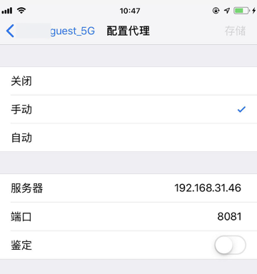

# 移动端给WiFi设置代理

之后再去给移动端的WiFi设置（PC端的mitmdump的）代理（信息）。

* 概述
  * 找到电脑端（Win/Mac等）中的WiFi地址，比如`192.168.1.10`
  * 然后去手机移动端（Android、iPhone等），给WiFi设置代理地址，代理地址为电脑端的WiFi地址
* 细节详见
  * [如何添加代理 移动端 · 网络中转站：代理技术](https://book.crifan.com/books/web_transfer_proxy_tech/website/add_proxy/mobile/)

此处简单举例如下：

# iOS

## iPhone

